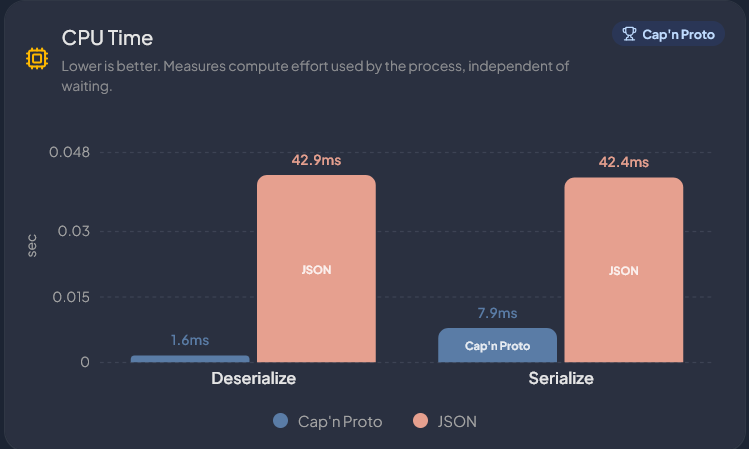

# Zero-Copy Benchmark

This project compares **Cap'n Proto** and **JSON** for serialization and deserialization speed.

We built this for the **VCET Arcade Hackathon**.

- **Team Name:** PS 5
- **Tech Focus:** We use **Cap'n Proto** for fast binary (zero-copy style) data handling.

## Live Demo

[https://zerocopy.mariakevin.in/](https://zerocopy.mariakevin.in/)

## Screenshot

## What this project does

- Runs benchmark tests for CPU time and throughput.
- Compares **Cap'n Proto** vs **JSON** side by side.
- Shows which one is faster in charts.
- Lets you run tests at different record sizes.

## Why Cap'n Proto

Cap'n Proto is a binary format.
It is generally faster and uses less CPU than text formats like JSON for this kind of heavy data processing.

